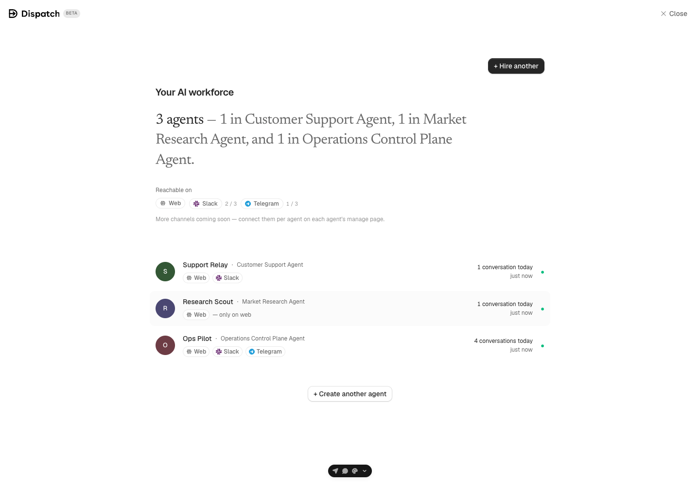
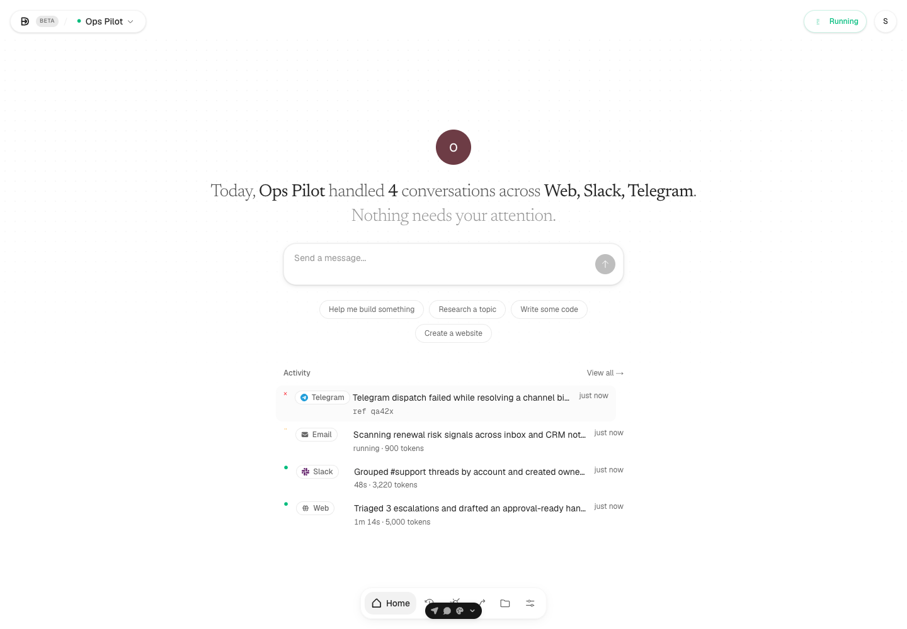
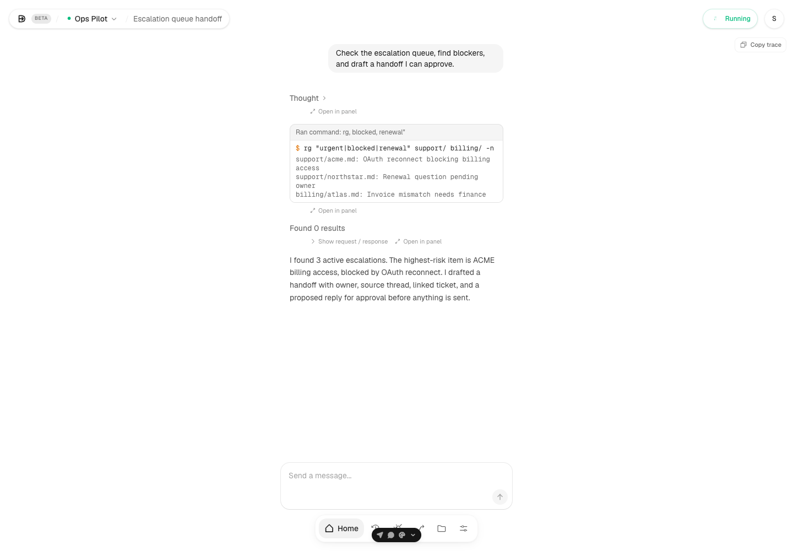
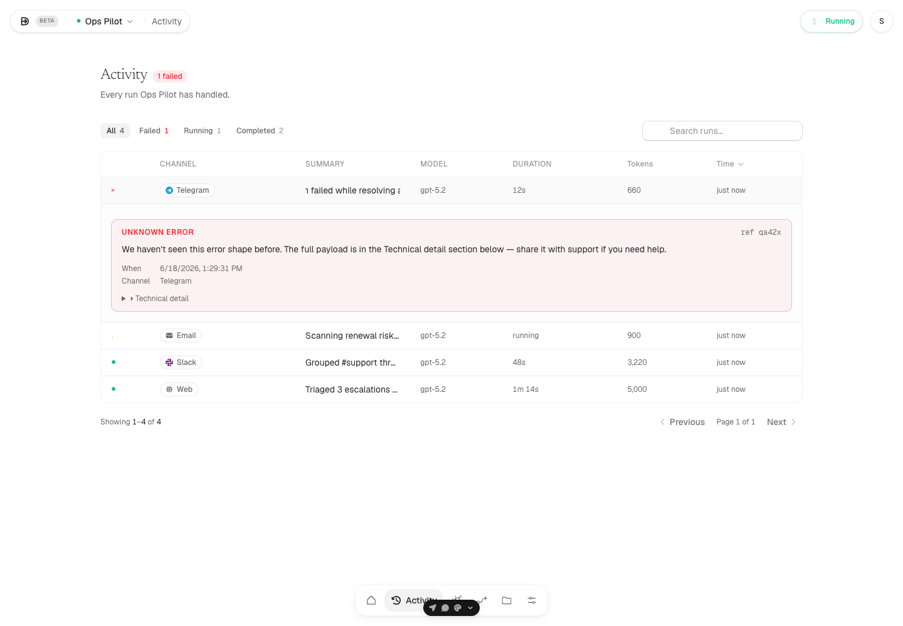
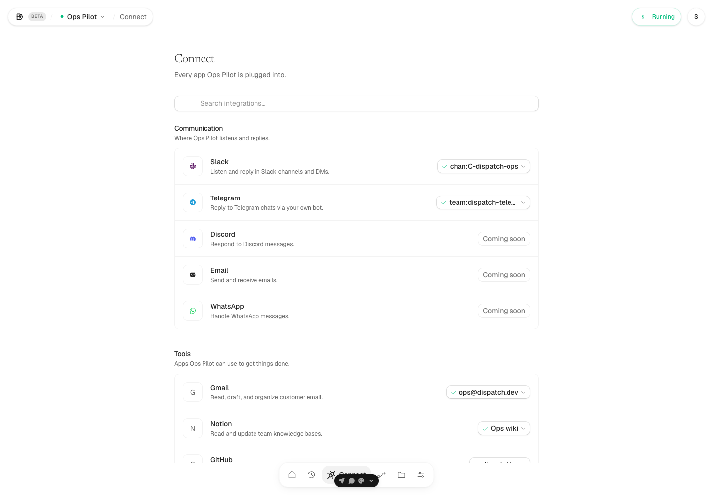
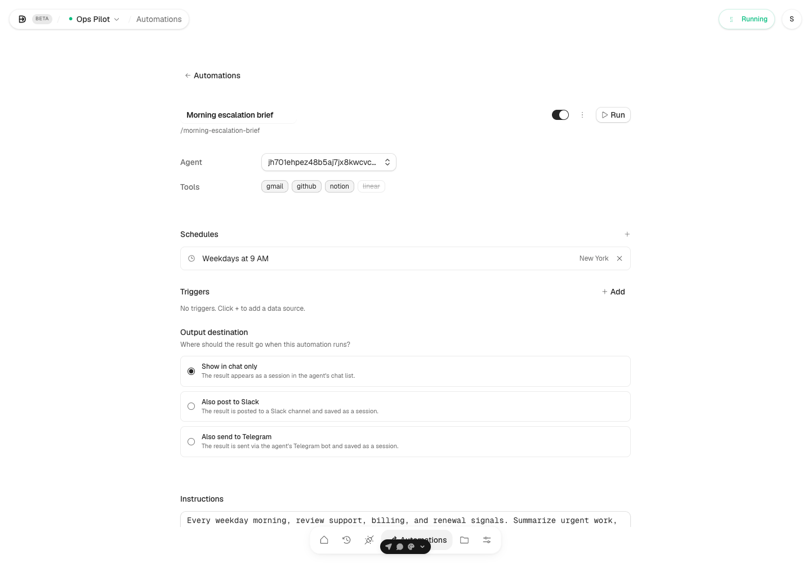
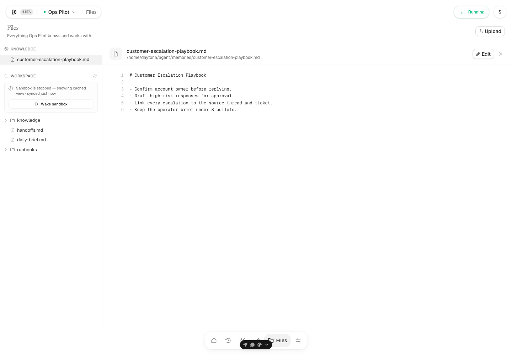
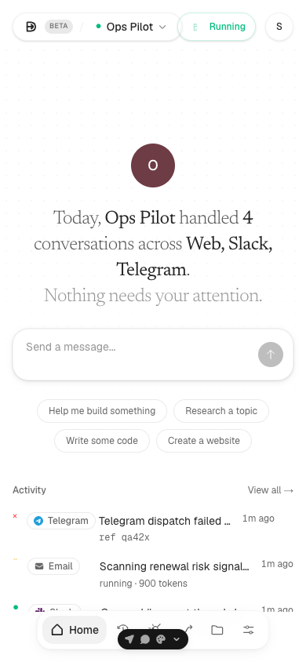
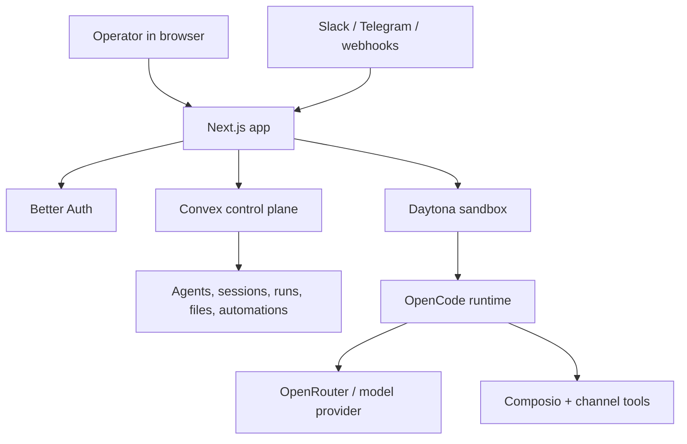

# Dispatch

Dispatch is an open-source control plane for running AI agents.

Create an agent, give it tools and channels, chat with it from the web, watch
what it did, and run it again on schedules or events. Dispatch is built for
self-hosting: the app is yours, the runtime is isolated per agent, and the
control plane keeps the operator in the loop.



## What Dispatch Does

Dispatch gives each agent a real workspace, not just a prompt box.

- **Agent workspace**: one place for chat, activity, integrations, automations,
  files, settings, and runtime status.
- **Web chat with tool traces**: chat with the agent and inspect the work it did.
- **Control-plane activity log**: see every run, channel, status, model, token
  usage, duration, and failure detail.
- **Integrations**: connect communication channels like Slack and Telegram, plus
  external tools through Composio.
- **Automations**: run agents on schedules, manual triggers, and future event
  triggers.
- **Files and memory**: browse agent knowledge files and cached workspace state.
- **Sandbox runtime**: each agent is provisioned into an isolated Daytona
  sandbox and driven by the OpenCode runtime harness.

## Product Tour

### Agent Command Center

The workspace starts with the agent's live status, chat composer, recent
activity, and quick access to the rest of the control plane.



### Chat With Tool Traces

Chat is not a black box. Dispatch can show the agent's reasoning-style steps,
tool calls, terminal output, and final response in the same workspace.



### Runs, Errors, And Auditing

The Activity page is the operator ledger for the agent: successful runs,
running jobs, failed webhook deliveries, token usage, and diagnostic payloads.



### Channels And Tools

Agents can be reached through customer-facing channels and equipped with
external toolkits. Connected accounts are scoped per agent.



### Automations

Turn recurring work into scheduled agent runs, then choose where the output
should land.



### Files And Memory

Agents keep durable knowledge files and expose their workspace tree so the
operator can inspect what the runtime is working with.



### Mobile

The workspace is usable on narrow screens for quick checks and triage.



## How It Works

Dispatch is a Next.js app backed by Convex. Agent work runs in Daytona
sandboxes through OpenCode.



Core request flow:

1. The operator creates an agent in the web app.
2. Dispatch stores the agent definition in Convex.
3. Dispatch provisions or wakes the agent's Daytona sandbox.
4. The runtime starts OpenCode with the agent's config, memory, and tool policy.
5. Chat, webhook, or automation requests stream through the Next.js API layer.
6. Dispatch records sessions, messages, runs, errors, files, and automation state
   back into Convex.

## Current Status

Dispatch is usable as a self-hosted app today, but it is not a single-binary
local stack yet.

What works today:

- Run the Next.js app yourself.
- Sign up, create agents, and manage them from the control plane.
- Provision per-agent Daytona sandboxes.
- Chat with agents through the web UI.
- Track runs, errors, sessions, and activity.
- Connect Slack and Telegram channel paths.
- Configure Composio toolkits for external apps.
- Define scheduled automations.

What still depends on hosted infrastructure:

- **Convex** for data, auth integration, subscriptions, and control-plane state.
- **Daytona** for per-agent sandbox compute and volumes.
- **OpenRouter or another model provider** for model access.
- **Composio** for external app toolkits.
- **A cron scheduler** for automations. Vercel Cron is optional and depends on
  your Vercel plan/cadence limits.

What is not fully packaged yet:

- One-command all-local deployment.
- First-class Docker Compose production template.
- Fully productized billing/admin surfaces.
- A polished onboarding wizard for every third-party provider.

## Stack

- **App**: Next.js 16, React 19, Tailwind CSS
- **Backend/control plane**: Convex
- **Auth**: Better Auth
- **Runtime**: OpenCode
- **Sandboxing**: Daytona
- **Models**: OpenRouter-compatible model access
- **Channels**: Slack, Telegram, web
- **Tools**: Composio toolkits
- **Package manager**: Bun

## Quick Start

Install dependencies:

```bash
bun install
```

Create your local environment file:

```bash
cp .env.example .env.local
```

Run Convex in one terminal:

```bash
npx convex dev
```

Run the app in another terminal:

```bash
bun run dev
```

Open:

```text
http://localhost:3000
```

## Required Services

At minimum, a useful Dispatch deployment needs:

- A public HTTPS URL for the Next.js app.
- A Convex deployment.
- Better Auth configured with a strong secret.
- Daytona API credentials.
- A model provider key.

Optional but common:

- Resend for password reset emails.
- Slack OAuth credentials.
- Telegram bot token.
- Composio API key.
- Stripe credentials if you enable billing paths.

## Environment Variables

Start from [`.env.example`](.env.example).

Minimum app/control-plane setup:

```bash
NEXT_PUBLIC_CONVEX_URL=
CONVEX_SITE_URL=
CONVEX_DEPLOYMENT=

SITE_URL=
NEXT_PUBLIC_APP_URL=
BETTER_AUTH_SECRET=
```

Runtime setup:

```bash
DISPATCH_RUNTIME_KIND=opencode
OPENROUTER_API_KEY=

DAYTONA_API_KEY=
DAYTONA_API_URL=
DAYTONA_TARGET=
```

Automation and webhook secrets:

```bash
CRON_SECRET=
CRON_INTERNAL_SECRET=
CHAT_STATE_INTERNAL_SECRET=
```

Optional integrations:

```bash
RESEND_API_KEY=
AUTH_EMAIL_FROM=

SLACK_CLIENT_ID=
SLACK_CLIENT_SECRET=
SLACK_SIGNING_SECRET=
SLACK_REDIRECT_URI=

TELEGRAM_BOT_TOKEN=
COMPOSIO_API_KEY=
```

Important URL rules:

- `SITE_URL` is the backend auth base URL.
- `NEXT_PUBLIC_APP_URL` is the public URL users and webhooks can reach.
- `CONVEX_SITE_URL` is required by the auth bridge and must end in `.convex.site`.
- Slack and Telegram need stable callback/webhook URLs.
- For local webhook work, use a tunnel or the included `portless` flow.

## Stable Local URLs

This repo includes a `portless` workflow so each worktree can get a stable local
subdomain.

Start the proxy:

```bash
bun run proxy:start
```

Start the app with tunnel support:

```bash
bun run dev:tunnel
```

Stop it with:

```bash
bun run proxy:stop
```

## Self-Hosting

Dispatch does not require Vercel for the web app. Any host that can run a
Next.js server can run the app.

Build:

```bash
bun run build
```

Start:

```bash
bun run start
```

Production checklist:

- Put the app behind HTTPS.
- Set `SITE_URL` and `NEXT_PUBLIC_APP_URL` to the public base URL.
- Point the app at a production Convex deployment.
- Set a long random `BETTER_AUTH_SECRET`.
- Configure Daytona credentials and verify sandbox creation.
- Configure model-provider credentials.
- Configure Slack, Telegram, and Composio only if you need those integrations.
- Provide a scheduler for `/api/cron/tick`.

## Scheduling

Dispatch ships a cron endpoint:

```text
GET /api/cron/tick
```

The repo does not ship an active Vercel Cron by default so self-hosted and
Hobby-plan deploys are not blocked by provider-specific schedule limits.

If you are on a Vercel plan that supports once-per-minute cron jobs, opt in by
copying the example config before deploying:

```bash
cp vercel.example.json vercel.json
```

Otherwise, run your own scheduler:

```bash
curl -H "Authorization: Bearer $CRON_SECRET" \
  https://your-dispatch.example.com/api/cron/tick
```

Use the same `CRON_SECRET` in your scheduler and app environment. Set
`CRON_INTERNAL_SECRET` so the cron route can call Convex's secret-gated
functions.

Without a scheduler, scheduled automations will not run on time.

## Integrations

### Slack

Slack requires an app at <https://api.slack.com/apps>.

Configure:

- OAuth and bot scopes.
- `SLACK_CLIENT_ID`
- `SLACK_CLIENT_SECRET`
- `SLACK_SIGNING_SECRET`
- `SLACK_REDIRECT_URI`

See [docs/SLACK_PRODUCTION_SETUP.md](docs/SLACK_PRODUCTION_SETUP.md).

### Telegram

Telegram requires a bot token and a public HTTPS app URL.

Configure:

- `TELEGRAM_BOT_TOKEN`
- `NEXT_PUBLIC_APP_URL`
- `CHAT_STATE_INTERNAL_SECRET`
- `SLACK_BIND_INTERNAL_SECRET`
- `TELEGRAM_WEBHOOK_SECRET` (a long random value used to authenticate updates)

See [docs/TELEGRAM_SETUP.md](docs/TELEGRAM_SETUP.md).

### Composio

Composio powers external app toolkits such as Gmail, GitHub, Notion, and
Linear.

Configure:

```bash
COMPOSIO_API_KEY=
```

### Email

If `RESEND_API_KEY` is configured, password reset links are emailed. If it is
missing, reset links are logged for local development.

## Repo Map

```text
app/
  (focused)/agents/              Agent list and create-agent flow
  (workspace)/[agentId]/          Agent workspace pages
  api/agents/                     Agent creation and provisioning routes
  api/agents/[id]/chat/           Web chat streaming route
  api/composio/                   Tool integration routes
  api/webhooks/                   Slack and Telegram webhook entrypoints
  api/cron/tick/                  Automation dispatcher

components/
  agent-chat.tsx                  Main chat container
  agent-elements/                 Chat and tool rendering primitives
  connect/                        Channel/tool integration rows
  workspace/                      Floating shell, dock, sandbox/user islands
  views/                          Page-level views

convex/
  schema.ts                       Data model
  agents.ts                       Agent CRUD and runtime metadata
  chat.ts                         Message persistence
  sessions.ts                     Session records
  runs.ts                         Run/activity ledger
  agentAutomations.ts             Automation records and lifecycle
  integrations.ts                 Channel bindings and integration summary

lib/
  agents/create.ts                Daytona sandbox provisioning
  agents/ensure-running.ts        Sandbox wake and readiness logic
  agents/opencode-config.ts       OpenCode config builder
  runtime/opencode.ts             OpenCode runtime adapter
  composio/                       External toolkit helpers
```

## Verification

Run the normal checks:

```bash
bun run lint
bun run typecheck
bun run build
```

Most important end-to-end path:

1. Sign up or sign in.
2. Create an agent.
3. Confirm the Daytona sandbox provisions.
4. Open the agent workspace.
5. Send a chat message.
6. Confirm the runtime responds.
7. Check that the session, messages, and run appear in the UI.
8. Visit Activity, Connect, Automations, Files, and Settings.

## Troubleshooting

### Agent creation fails during provisioning

Check Daytona credentials and snapshot availability:

- `DAYTONA_API_KEY`
- `DAYTONA_API_URL`
- `DAYTONA_TARGET`
- Any configured OpenCode snapshot referenced by the provisioning path

### Connect page has no tool catalog

Check:

- `COMPOSIO_API_KEY`
- Whether the key is valid for the Composio API endpoint
- Browser/server logs for `401` responses

### Automations do not run

Check:

- A scheduler is calling `/api/cron/tick`
- `CRON_SECRET` matches the request `Authorization` header
- `CRON_INTERNAL_SECRET` is set in the app environment

### Auth redirects or callbacks fail

Check:

- `SITE_URL`
- `NEXT_PUBLIC_APP_URL`
- `CONVEX_SITE_URL`
- Provider callback URLs in Slack, Google, Telegram, or any tunnel you use

## Documentation

- [docs/DEV_AND_PROD_SETUP.md](docs/DEV_AND_PROD_SETUP.md)
- [docs/V2_ARCHITECTURE.md](docs/V2_ARCHITECTURE.md)
- [docs/SLACK_PRODUCTION_SETUP.md](docs/SLACK_PRODUCTION_SETUP.md)
- [docs/TELEGRAM_SETUP.md](docs/TELEGRAM_SETUP.md)
- [docs/LESSONS_FROM_CLAUDE_CODE.md](docs/LESSONS_FROM_CLAUDE_CODE.md)
- [docs/MIGRATION_GUIDE.md](docs/MIGRATION_GUIDE.md)

## Security note

Slack and Telegram participants can drive the connected agent with the tools
and integrations configured by its owner. Only bind agents to workspaces and
channels whose participants you trust, and grant the minimum tool permissions
needed for that agent.

## License

Dispatch is available under the [MIT License](LICENSE).
